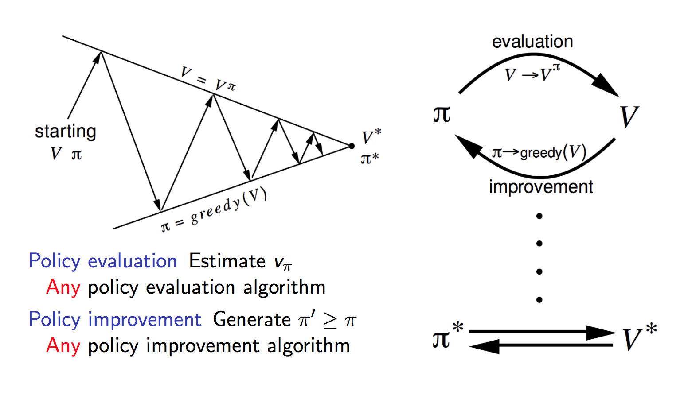

@snap
@size[2.3em](RL Course)
@snapend
---

@snap
Basic Concepts
@snapend

+++

@snap[north-west]
Agent
@snapend

@snap[west mario]

@snapend

@snap[east text-right p20 justify]
It represents the RL algorithm. The environment starts by sending a state to the agent, which then based on its knowledge to take an action in response to that state. The agent will update its knowledge with the reward returned by the environment to evaluate its last action.
@snapend

+++
@snap[north-west]
Environment
@snapend

@snap[west world]

@snapend

@snap[east text-right p20 justify]
The environment its task is to define a world where an agent is able to interact with. It therefore has a basic loop that can be written like this:

Produce state s and reward r where our state s represents the current situation in the environment and the reward r represents the scalar value being returned by the environment after selecting an action a.
@snapend

+++
@snap[north-west]
Reward
@snapend

@snap[west reward]

@snapend

@snap[east text-right p20 justify]
Here the term “reward” is an abstract concept that describes feedback from the environment. A reward can be positive or negative. When the reward is positive, it is corresponding to our normal meaning of reward. When the reward is low or even negative, it is corresponding to what we usually call “punishment.”
@snapend

+++
@snap

@snapend

@snap[p20 justify rl-diagram]
The main characters of RL are the agent and the environment. The environment is the world that the agent lives in and interacts with. At every step of interaction, the agent sees a (possibly partial) observation of the state of the world, and then decides on an action to take. The environment changes when the agent acts on it, but may also change on its own.

The agent also perceives a reward signal from the environment, a number that tells it how good or bad the current world state is. The goal of the agent is to maximize its cumulative reward, called return. Reinforcement learning methods are ways that the agent can learn behaviours to achieve its goal.
@snapend

---

@snap
Markov Decision Process
@snapend

+++

@snap
Markov Property
@snapend

`\(P[s_{t+1}|s_t] = P[s_{t+1} | s_1, ..., s_t] \)`

+++

@snap
@ol[list-bullets-black](false)

	- S is a finite set of states
	- A is a finite set of actions (alternatively, `\(A_s \)` is the finite set of actions available from state `\(s)\)`
	- `\(T(s'|s, a) = T(s_{t+1} = s' | s_t = s, a_t = a) \)` is the probability that action a in state s at time t will lead to state s' at time t+1
	- `\(R(s, a) \)` is the immediate reward (or expected immediate reward) received after transitioning from state `\(s\)` to state `\(s'\)`, due to action `\(a\)`
	- `\(\gamma ∈ [0,1] \)` is the discount factor, which represents the difference in importance between future rewards and present rewards
@olend
@snapend
+++

@snap
Policy
@snapend

`\(π[a|s] = P[A_t = a | s_t = s] \)`

+++?image=assets/images/policy.png&size=auto 70%

+++

@snap 
State Value Function
@snapend
  
@snap 

`\(V_π(s)\)` expresses the expected value of following policy `\(π\)` forever when the agent starts following it from state `\(s\)`.
  
`\(V_π(s) = E_π[G_t | S_t = s] \)`

@snapend
+++?image=assets/images/value.png&size=auto 70%
 
+++
@snap 
Action Value Function
@snapend
  
@snap[] 

`\(Q_π(s, a)\)` expresses the expected value of first taking action `\(a\)` from state `\(s\)` and then following policy `\(π\)` forever.
  
`\(Q_π(s, a) = E_π[G_t | S_t = s, A_t = a] \)`

@snapend

+++

@ol[list-bullets-black](false)
- For any Markov Decision Process
There exists an optimal policy `\(π_*\)` that is better than or equal
to all other policies, `\(π_* ≥ π, ∀π\)` 
- All optimal policies achieve the optimal value function, `\(v_{π_∗}(s) = v_∗(s)\)` 
- All optimal policies achieve the optimal action-value function, `\(q_{π_∗}(s, a) = q_∗(s, a)\)`

@olend
---

@snap 
Bellman Equation
@snapend

+++
@snap[north-west] 
Bellman Expectation Equation
@snapend
  

@snap
`\(Q_π(s, a) = E_π[R_{t+1} + \gamma q_π(S_{t+1}, A_{t+1}) | S_t = s, A_t = a] \)`
  

`\(V_π(s) = E_π[R_{t+1} + \gamma V_π(S_{t+1}) | S_t = s] \)`
  

@snapend
---

@snap 
Model free VS Model based
@snapend

+++
@snap[north-west] 
Model free
@snapend

@ol[list-bullets-black](false)
- Trial and error
- Not require storage all combinations
- Q-Learning => Estimate `\(Q(s, a)\)`
- Policy search on policy space
@olend
+++

@snap[north-west] 
Model Based
@snapend

@ol[list-bullets-black](false)
- Learn the transition `\(T(s1 | s0, a)\)`
- Become impractical `\((S * S * A)\)` tabular setup
- Model learns how environment works => Plan solution using that model
@olend
---

@snap
On-Policy VS Off-Policy
@snapend

+++
@snap[north-west] 
On-Policy
@snapend
Estimate the value of a policy while using it for control. Agent learns the value based on its current action a derived from the current policy.

+++

@snap[north-west] 
Off-Policy

@snapend

The agent learns a policy which (usually) evaluates the “value” of taking various actions while in a certain state. Another policy (epsilon-greedy for example) uses that policy and makes decisions.

---

@snap 
Policy Iteration
@snapend

+++
This algorithm re-define the policy at each step and compute the value according to this new policy until the policy converges.

Policy iteration runs an loop between policy evaluation and policy improvement.
+++

+++?image=assets/images/policy_iteration_algorithm.png&size=auto 70%
---

@snap 
Value Iteration
@snapend

+++
Value iteration computes the optimal state value function by iteratively improving the estimate of V(s). The algorithm initialize `\(V(s)\)` to arbitrary random values. It repeatedly updates the `\(Q(s, a)\)` and `\(V(s)\)` values until they converges. Value iteration is guaranteed to converge to the optimal values.

+++?image=assets/images/value_iteration.png&size=auto 30%

+++?image=assets/images/value_iteration_algorithm.png&size=auto 70%

---

@snap
Q-Learning
@snapend
---

@snap 
SARSA
@snapend
---

@snap 
DQN
@snapend
---

@snap 
DDPG
@snapend
---
