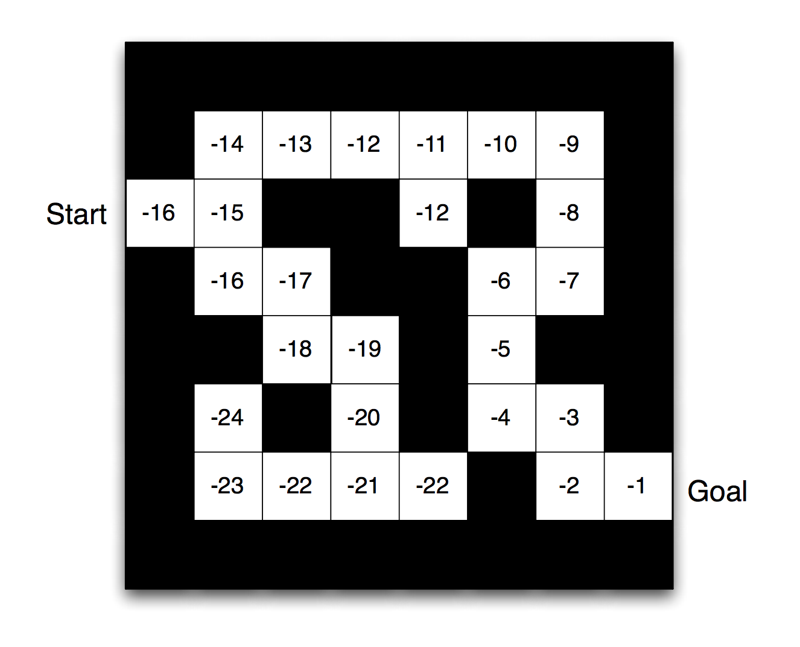

@snap
@size[2.3em](RL Course)
@snapend
---
@snap
Markov Decision Process
@snapend

+++

@snap
Markov Property
@snapend

`\(P[s_{t+1}|s_t] = P[s_{t+1} | s_1, ..., s_t] \)`

+++

@snap
@ol[list-bullets-black](false)

	- S is a finite set of states
	- A is a finite set of actions (alternatively, `\(A_s \)` is the finite set of actions available from state `\(s)\)`
	- `\(T(s'|s, a) = T(s_{t+1} = s' | s_t = s, a_t = a) \)` is the probability that action a in state s at time t will lead to state s' at time t+1
	- `\(R(s, a) \)` is the immediate reward (or expected immediate reward) received after transitioning from state `\(s\)` to state `\(s'\)`, due to action `\(a\)`
	- `\(\gamma ∈ [0,1] \)` is the discount factor, which represents the difference in importance between future rewards and present rewards
@olend
@snapend
+++

@snap
Policy
@snapend

`\(π[a|s] = P[A_t = a | s_t = s] \)`

+++

@snap[]

@snapend
+++

@snap 
State Value Function
@snapend
  
@snap[] 

`\(V_π(s)\)` expresses the expected value of following policy `\(π\)` forever when the agent starts following it from state `\(s\)`.
  
`\(V_π(s) = E_π[G_t | S_t = s] \)`

@snapend
+++

@snap

@snapend
 
+++
@snap 
Action Value Function
@snapend
  
@snap[] 

`\(Q_π(s, a)\)` expresses the expected value of first taking action `\(a\)` from state `\(s\)` and then following policy `\(π\)` forever.
  
`\(Q_π(s, a) = E_π[G_t | S_t = s, A_t = a] \)`

@snapend

+++

@snap[north-west] 
Bellman Expectation Equation
  
`\(Q_π(s, a) = E_π[R_{t+1} + \gamma q_π(S_{t+1}, A_{t+1}) | S_t = s, A_t = a] \)`
  

`\(V_π(s) = E_π[R_{t+1} + \gamma V_π(S_{t+1}) | S_t = s] \)`
  

@snapend
+++

@ol[list-bullets-black](false)
- For any Markov Decision Process
There exists an optimal policy `\(π_*\)` that is better than or equal
to all other policies, `\(π_* ≥ π, ∀π\)` 
- All optimal policies achieve the optimal value function, `\(v_{π_∗}(s) = v_∗(s)\)` 
- All optimal policies achieve the optimal action-value function, `\(q_{π_∗}(s, a) = q_∗(s, a)\)`

@olend
---

@snap 
Model free VS Model based
@snapend

+++
@snap[north-west] 
Model free
@snapend

@ol[list-bullets-black](false)
- Trial and error
- Not require storage all combinations
- Q-Learning => Estimate `\(Q(s, a)\)`
- Policy search on policy space
@olend
+++

@snap[north-west] 
Model Based
@snapend

@ol[list-bullets-black](false)
- Learn the transition `\(T(s1 | s0, a)\)`
- Become impractical `\((S * S * A)\)` tabular setup
- Model learns how environment works => Plan solution using that model
@olend
---

@snap
On-Policy VS Off-Policy
@snapend

+++
@snap[north-west] 
On-Policy
@snapend
Estimate the value of a policy while using it for control

+++

@snap[north-west] 
Off-Policy

@snapend
---

@snap 
Policy Iteration
@snapend
---

@snap 
Value Iteration
@snapend
---

@snap
Q-Learning
@snapend
---

@snap 
SARSA
@snapend
---

@snap 
DQN
@snapend
---

@snap 
DDPG
@snapend
---
